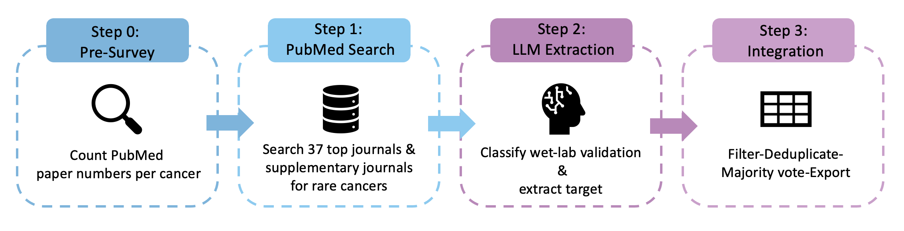

# TCGA Wet-Lab Validated Target Mining Pipeline

An LLM-powered automated pipeline that systematically mines **wet-lab experimentally validated** molecular targets across all **33 TCGA cancer types** from high-impact biomedical literature.

## Overview

PubMed contains >37 million biomedical articles. Target-disease associations are scattered across tens of thousands of papers, and most bioinformatics predictions lack experimental validation. This pipeline:

1. Literature screening across top-tier journals for each cancer type
2. Uses a large language model (e.g., DeepSeek) to read every abstract and determine whether it contains wet-lab validation
3. Extracts structured target-disease associations (gene symbol, expression change, functional role, experimental evidence, etc.)
4. Outputs a CSV for downstream analysis

## Pipeline Architecture



## Setup

### Prerequisites

```bash
pip install biopython openai pandas tqdm
```

### Configuration

```bash
cp config.example.py config.py
# Edit config.py with your API keys:
#   - NCBI_EMAIL: your email for PubMed API
#   - NCBI_API_KEY: optional, improves rate limits
#   - DEEPSEEK_API_KEY: from platform.deepseek.com
```

### Environment Variables (Optional)

| Variable | Purpose | Default |
|----------|---------|---------|
| `PIPELINE_CANCERS` | Run specific cancer types, e.g. `ACC,BRCA,LIHC` | All 33 |
| `PIPELINE_TAG` | Suffix for output files (isolates runs) | None |
| `PIPELINE_MAX_CANCERS` | Limit to first N cancer types | All |
| `PIPELINE_PAPERS_PER_CANCER` | Cap papers per cancer in Step 2 (0 = no further cap, all from Step 1) | 0 (up to 200 from Step 1) |
| `EXTRACT_MAX_WORKERS` | Thread count for LLM extraction | 8 |
| `EXTRACT_MAX_RETRIES` | Max API retries | 3 |
| `SKIP_GENE_MAPPING` | Set to `true` to skip HGNC download & gene mapping | false |

## Usage

### Full Pipeline

```bash
# Step 0: Pre-survey (optional)
python step_0.py

# Step 1: Search PubMed
python step1_search.py
# Output: data/papers_all.json  (one JSON per cancer + combined)

# Step 2: LLM Target Extraction
python step2_extract.py
# Output: data/extractions_all.json

# Step 3: Integrate & Export
python step3_integrate.py
# Output: output/final_targets.csv + output/pipeline_summary.md
# On first run: auto-downloads HGNC gene database (~32 MB) for symbol standardization
# Skip with: SKIP_GENE_MAPPING=true python step3_integrate.py
```

### Mini Test Run (single cancer)

```bash
PIPELINE_CANCERS=ACC PIPELINE_TAG=accmini python step1_search.py
PIPELINE_CANCERS=ACC PIPELINE_TAG=accmini python step2_extract.py
PIPELINE_CANCERS=ACC PIPELINE_TAG=accmini python step3_integrate.py
```

### Resume After Interruption

All steps support checkpoint/resume — just re-run the same command. Already-processed cancer types (Step 1) or PMIDs (Step 2) will be skipped automatically.

```bash
# Prevent laptop sleep during long Step 2 runs
caffeinate -i python step2_extract.py
```

### Gene Standardization

Step 3 automatically maps the LLM-extracted target names to standardized identifiers using the [HGNC](https://www.genenames.org/) complete set:

1. **First run:** downloads `hgnc_complete_set.json` (~32 MB) to `data/` — one-time cost
2. **Subsequent runs:** uses the cached file, no network needed
3. **Alias resolution:** colloquial names are corrected (e.g., HER2 → ERBB2, p53 → TP53, Hsp90 → HSP90AA1)
4. **Non-gene targets:** pathways, miRNAs, and lncRNAs get empty gene ID columns (they have no NCBI Gene ID)

Three new columns are added to the final CSV:

| Column | Example | Purpose |
|--------|---------|---------|
| `official_symbol` | ERBB2 | HGNC-approved gene symbol |
| `ncbi_gene_id` | 2064 | NCBI Gene ID → cBioPortal, GO/KEGG enrichment |
| `ensembl_id` | ENSG00000141736 | Ensembl ID → TCGA, RNA-seq integration |

To skip gene mapping for quick test runs:

```bash
SKIP_GENE_MAPPING=true PIPELINE_CANCERS=ACC PIPELINE_TAG=quick python step3_integrate.py
```

## Output Format

The final CSV (`output/final_targets.csv`) contains one row per target-disease association:

| Column | Description |
|--------|-------------|
| `id` | Primary key: `{TCGA_CODE}_{sequence_number}` |
| `tcga_code` | TCGA cancer type code (e.g., ACC, BRCA) |
| `disease_en` / `disease_cn` | Disease name |
| `target` | HGNC gene symbol, miRNA, lncRNA, or pathway name |
| `target_type` | gene / protein / miRNA / lncRNA / pathway |
| `official_symbol` | HGNC-approved official gene symbol (empty for non-gene targets) |
| `ncbi_gene_id` | NCBI Gene ID for cBioPortal / GO-KEGG enrichment (empty for non-genes) |
| `ensembl_id` | Ensembl Gene ID for TCGA / RNA-seq integration (empty for non-genes) |
| `expression_change` | Upregulated / Downregulated / Unchanged / Null |
| `functional_role` | Oncogene / Tumor suppressor / Protective / Risk / Biomarker / Null (with majority vote count) |
| `evidence_summary` | One-sentence experimental evidence per supporting paper |
| `validation_methods` | Experimental methods (Western blot, CRISPR, xenograft, etc.) |
| `experimental_detail` | Detailed experimental finding from each paper |
| `model_type` | cell line / animal model / clinical sample / mixed |
| `pmid` / `doi` | PubMed ID and DOI (semicolon-joined if multiple papers) |
| `n_papers` | Number of supporting papers for this target-disease association |

### Pipeline Summary (`output/pipeline_summary.md`)

A human-readable Markdown report is generated alongside the CSV, containing:

- **Overview** — aggregate statistics (papers screened, wet-lab rate, total targets, cross-cancer targets)
- **Per-Cancer Breakdown** — all 33 cancer types with screened/wet-lab/review/insufficient/other/targets/supporting-papers columns
- **Cross-Cancer Targets** — targets appearing in ≥3 cancer types with specific cancer type annotations
- **Configuration** — model, parameters, source file paths

This report persists after the terminal session ends and renders natively on GitHub.

## Notes

- `config.py` contains real API keys and is gitignored. Use `config.example.py` as a template.
- The `data/` and `output/` directories are gitignored — generated at runtime.
- NCBI Entrez API requires your email; add an API key for higher rate limits.
- DeepSeek extraction for all 33 cancers × 200 papers takes ~2-3 hours with 8 threads.
- **Gene standardization:** On first run, Step 3 downloads the HGNC complete set (~32 MB) to `data/hgnc_complete_set.json`. This is a one-time download. Set `SKIP_GENE_MAPPING=true` to skip this step for quick test runs.
